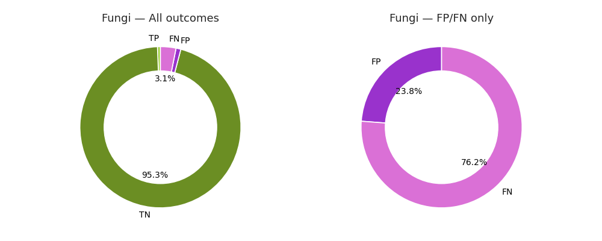
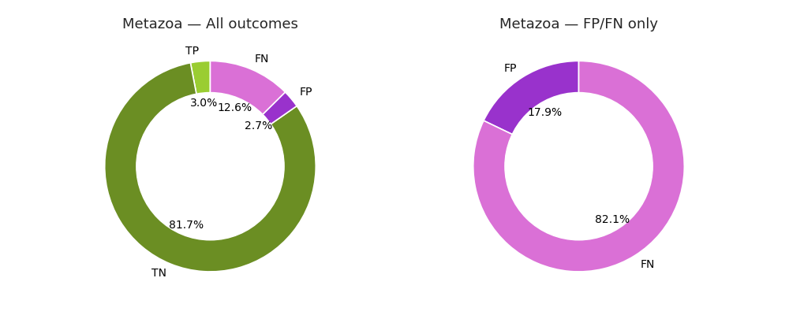
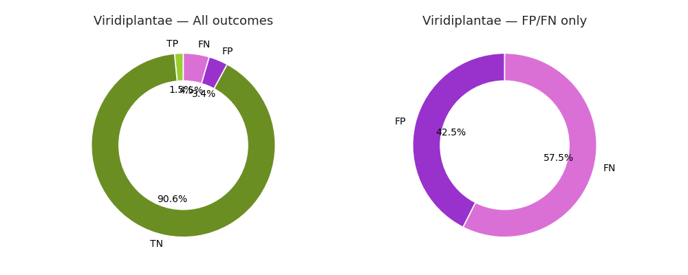

# LAB2_project_group_13
#### Rebecca Barbera, Aniello Di Vaio, Nina Talajic, Domenico Zianni

---

## 🧭 Project Process Overview
```
Project Overview
|
|-- Data Collection
|    |-- Positive Dataset
|    |-- Negative Dataset
|
|-- Data Filtering
|    |-- Quality Checks
|    |-- Output Files (.tsv, .fasta)
|
|-- Data Pre-processing
|    |-- Clustering (MMSeqs2)
|    |-- Data Split (Train / Benchmark)
|    |-- Cross Validation
|
|-- Data Analysis
|    |-- Amino Acid Composition
|    |-- Taxonomic Classification
|
|-- Modeling
|    |-- Von Heijne Method
|    |-- Support Vector Machine (SVM)
|
|-- Performance Evaluation
```

---

## 📘 Table of Contents
- [Software and Tools Needed](#software-and-tools-needed)
- [Data Collection](#1-data-collection)
- [Data Filtering Pipeline](#2-data-filtering-pipeline)
  - [Output Files](#output-files)
  - [Dataset Summary](#dataset-summary)
- [Data Pre-processing](#3-data-pre-processing)
  - [Clustering](#clustering)
  - [Filtering into TSV](#filtering-into-a-tsv-file)
  - [Data Clustering Summary Table](#data-clustering-summary-table)
  - [Data Split](#data-split)
  - [Cross Validation](#five-fold-cross-validation)
- [Data Analysis](#4-data-analysis)
  - [Protein Length Distribution](#distribution-of-protein-lengths)
  - [SP Position Distribution](#distrubution-of-sp-position)
  - [Amino Acid Composition](#comparative-amino-acid-composition)
  - [Taxonomic Classification](#taxonomic-classification)
- [Von Heijne Model](#the-von-heijne-method)
- [Support Vector Machine](#support-vector-machine)
- [Performance Evaluation](#performance-evaluation)

---

## 🧩 Software, Packages and Tools Needed
- `Python 3` → main programming language for data processing.
- `Biopython (Bio.SeqIO)` → for handling FASTA input/output.
- `Requests` → for making HTTP requests to UniProt REST API.
- `GitHub` / `Git` → for version control and collaboration.
- `MMSeqs2` → software suite used for clustering.

---

## 1. Data Collection
The first step is to retrieve both positive and negative datasets for evaluation.
Database used: [UniProt](https://www.uniprot.org)

#### Common Criteria for Protein Selection
##### Both Positive and Negative Datasets:
- Protein length
- Protein evidence
- Protein annotation status
- Protein superkingdom
- Fragments
##### Positive Dataset:
- Signal peptide evidence
- Knowledge of Signal Peptide (SP) cleavage site
- SP length > 13

Positive and negative datasets were retrieved using UniProt REST API queries and saved in JSON format.

---

## 2. Data Filtering Pipeline
The next step filters datasets according to established quality and biological criteria.

**Positive Dataset Filters:**
- No fragments, Eukaryotic proteins only, ≥ 40 residues, reviewed, experimental SP evidence, SP > 13 residues, protein-level evidence.

**Negative Dataset Filters:**
- No fragments, reviewed, protein-level evidence, ≥ 40 residues, experimentally verified localization (non-secretory).

Output files:
- `positive_set.tsv`, `negative_set.tsv`, `positive_set.fasta`, `negative_set.fasta`

**Dataset Summary:**
<p align="center">

| Dataset  | Total | Metazoa | Fungi | Viridiplantae | Other | N-terminal TM helix |
|----------|-------|---------|-------|---------------|-------|----------------------|
| Positive | 2932  | 2420 | 165 | 311 | 36 | - |
| Negative | 20615 | 12419 | 3727 | 4111 | 358 | 2477 |

</p>

---

## 3. Data Pre-processing
Includes clustering with MMSeqs2, dataset splitting (80/20), and five-fold cross-validation.

<p align="center">

| Dataset  | Total | Metazoa | Fungi | Viridiplantae | Other | N-terminal TM helix |
|----------|-------|---------|-------|---------------|-------|----------------------|
| Positive | 1092  | 866 | 95 | 103 | 28 | - |
| Negative | 8934 | 4697 | 2475 | 1594 | 168 | 900 |

</p>

Data split (80/20):
<p align="center">

| Set       | Positive | Negative | Total |
|-----------|----------|----------|-------|
| Training  | 873      | 7147     | 8020  |
| Benchmark | 219      | 1787     | 2006  |

</p>

---

## 4. Data Analysis
- Protein length distributions
- SP position distributions
- Comparative amino acid composition
- Taxonomic classification

<p align="center">

| Analysis                          | Visualization |
|-----------------------------------|---------------|
| Distribution of Protein Lengths    | [Protein Lengths](data_analysis/Density_plot.png) |
| Distribution of SP Position        | [SP Position](data_analysis/SPPosition.png) |
| Comparative Amino Acid Composition | [AA Composition](data_analysis/AA_comparison.png) |
| Taxonomic Classification           | [Benchmark](data_analysis/Kingdom_dist_bench.png) / [Training](data_analysis/Kingdom_dist_train.png) |

</p>

---

## 5. Von Heijne Method
Modeling SPs using Position-Specific Weight Matrices (PSWM) and Probability Matrices (PSPM) compared with Swiss-Prot.

<p align="center">

| Fold | Training Folds | Validation Fold | Testing Fold | Motifs | Optimal Threshold | F1 | Precision | Recall | MCC |
|------|----------------|----------------|---------------|--------|------------------|----|------------|---------|------|
| 1 | ac, ad, ae | ab | aa | 531 | 6.437 | 0.691 | 0.693 | 0.689 | 0.653 |
| 2 | aa, ad, ae | ac | ab | 528 | 6.020 | 0.707 | 0.645 | 0.782 | 0.674 |
| 3 | aa, ab, ae | ad | ac | 519 | 6.212 | 0.722 | 0.716 | 0.728 | 0.686 |
| 4 | aa, ab, ac | ae | ad | 522 | 6.303 | 0.718 | 0.712 | 0.724 | 0.683 |
| 5 | ab, ac, ad | aa | ae | 519 | 5.735 | 0.730 | 0.670 | 0.802 | 0.697 |

</p>

---

## 6. Support Vector Machine (SVM)
Comparison between Von Heijne and SVM-based prediction models using 31 physicochemical features.

<p align="center">

| Fold | Random Forest | Accuracy | Confusion Matrix | CM Top Features |
|------|---------------|-----------|------------------|-----------------|
| 1 | [RF_Gini_fold1](7_SVM/RF_Gini_fold1.png) | [Acc_fold1](7_SVM/acc_vs_features_fold1.png) | [CM1](7_SVM/confusion_matrix_fold1_all.png) | [CM_Top1](7_SVM/confusion_matrix_fold1_Top22.png) |
| 2 | [RF_Gini_fold2](7_SVM/RF_Gini_fold2.png) | [Acc_fold2](7_SVM/acc_vs_features_fold2.png) | [CM2](7_SVM/confusion_matrix_fold2_all.png) | [CM_Top2](7_SVM/confusion_matrix_fold1_Top19.png) |
| 3 | [RF_Gini_fold3](7_SVM/RF_Gini_fold3.png) | [Acc_fold3](7_SVM/acc_vs_features_fold3.png) | [CM3](7_SVM/confusion_matrix_fold3_all.png) | [CM_Top3](7_SVM/confusion_matrix_fold1_Top29.png) |
| 4 | [RF_Gini_fold4](7_SVM/RF_Gini_fold4.png) | [Acc_fold4](7_SVM/acc_vs_features_fold4.png) | [CM4](7_SVM/confusion_matrix_fold4_all.png) | [CM_Top4](7_SVM/confusion_matrix_fold1_Top24.png) |
| 5 | [RF_Gini_fold5](7_SVM/RF_Gini_fold5.png) | [Acc_fold5](7_SVM/acc_vs_features_fold5.png) | [CM5](7_SVM/confusion_matrix_fold5_all.png) | [CM_Top5](7_SVM/confusion_matrix_fold1_Top24.png) |

</p>

---

## 7. Performance Evaluation
The trained PSWM model was evaluated across four taxonomic kingdoms to assess lineage-specific performance.

<p align="center">

| Kingdom | TP | TN | FP | FN |
|----------|----|----|----|----|
| Fungi | 15 | 2450 | 25 | 80 |
| Metazoa | 167 | 4545 | 152 | 699 |
| Other | 3 | 163 | 5 | 25 |
| Viridiplantae | 26 | 1537 | 57 | 77 |

</p>

### Error Distribution Plots
<p align="center">




</p>

---

